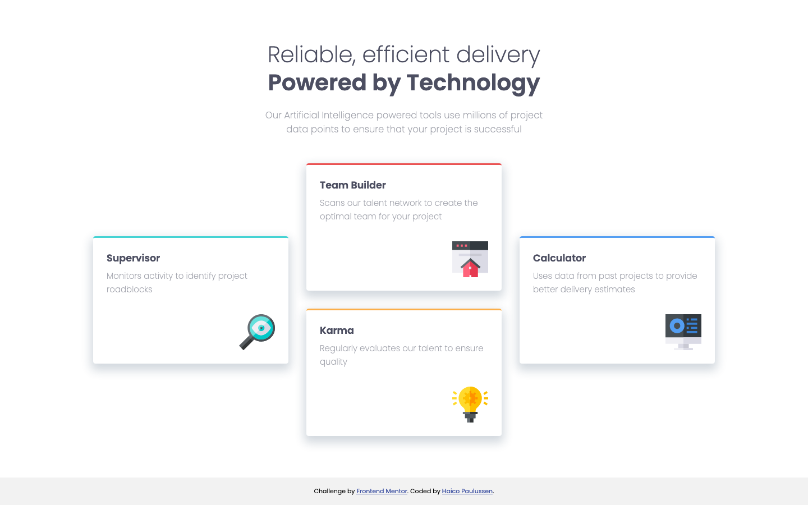

# Frontend Mentor - Four card feature section solution

This is a solution to the [Four card feature section challenge on Frontend Mentor](https://www.frontendmentor.io/challenges/four-card-feature-section-weK1eFYK). Frontend Mentor challenges help you improve your coding skills by building realistic projects. 

## Table of contents

- [Overview](#overview)
  - [The challenge](#the-challenge)
  - [Screenshot](#screenshot)
  - [Links](#links)
- [My process](#my-process)
  - [Built with](#built-with)
  - [What I learned](#what-i-learned)
  - [Continued development](#continued-development)
- [Author](#author)

## Overview

### The challenge

Users should be able to:

- View the optimal layout for the site depending on their device's screen size

### Screenshot



### Links

- Solution URL: [Frontend Mentor](https://www.frontendmentor.io/solutions/responsive-4-card-landing-page-with-css-grid-uk-SmLmSc)
- Live Site URL: [Github Pages](https://haico-paulussen.github.io/four-card-css-grid/)

## My process

### Built with

- Semantic HTML5 markup
- CSS custom properties
- CSS Grid
- Mobile-first workflow

### What I learned

Well I have to say: I'm proud of myself. I just started learning CSS Grid a few days ago and I already succesfully used the basics in a challenge. This challenge only took me around 2 - 3 hours. So yeah, I'm proud of myself and my learning curve the past few weeks. 

```css
  body .card-section {
        grid-template-rows: 1fr 1fr 2rem 1fr 1fr;
        grid-template-columns: 1fr 1fr 1fr;
        grid-gap: 0 2rem;
        grid-template-areas: ". team .""supervisor team calculator""supervisor . calculator""supervisor karma calculator"". karma .";
    }
```

### Continued development

I want to solidify my CSS Grid knowledge by using it in every project and keep learning about it. Next step will be to start (re-)learning vanilla JavaScript.

Long term speaking: Vue.js, nuxt.js and maybe other framworks.

## Author

- Frontend Mentor - [@Haico-Paulussen](https://www.frontendmentor.io/profile/Haico-Paulussen)
- LinkedIn - [Haico Paulussen](https://www.linkedin.com/in/haico-paulussen-160281158/)

